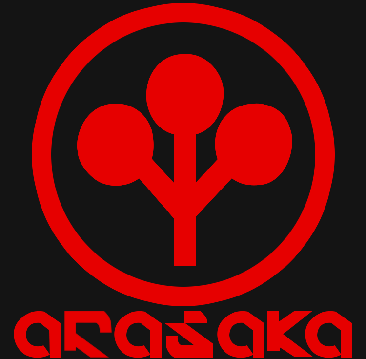
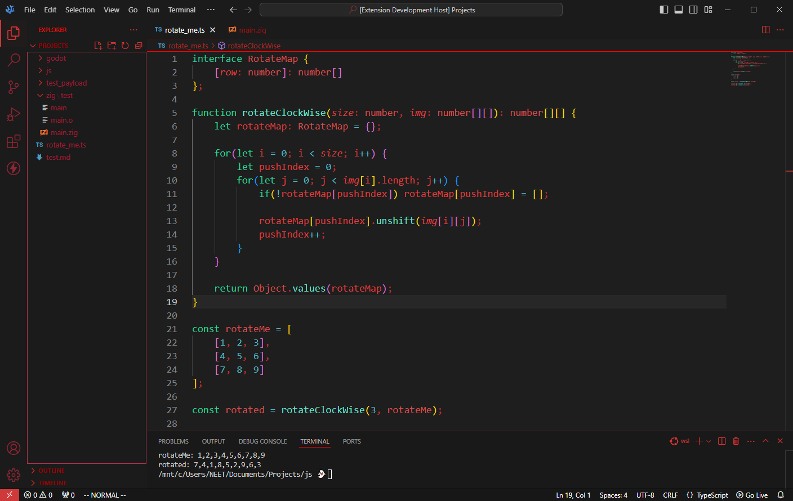
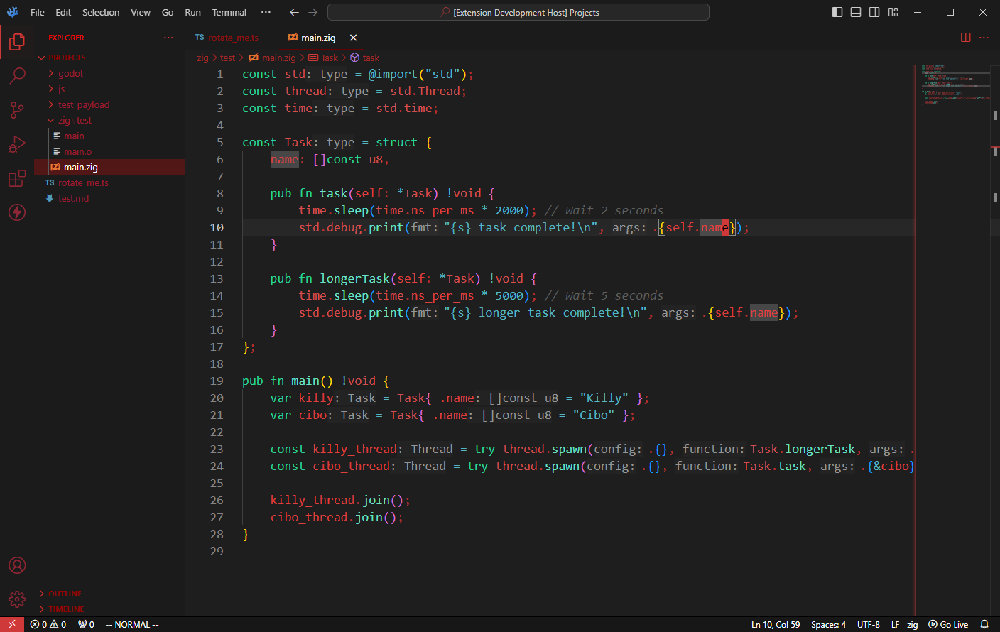

# Arasaka

VSCode/VSCodium theme inspired by fictional corporation, "Arasaka" from Mike Pondsmith's "CyberPunk" series. 

In the "Cyberpunk 2077" videogame by CD Projekt Red, we get glimpses on what everyone's computers look like in-game.
Although we never specifically see any of Arasaka's Software Engineers' IDEs, we could access some Arasaka computers
early on in the Corpo life-path within the game. Their computers' themes being the same as everyone else's and is also
on-brand for Arasaka's colors (their brand colors being red and black). The supporting colors are inspired from Cyberpunk 2077's in-game menus/computer theme.

## Preview:

